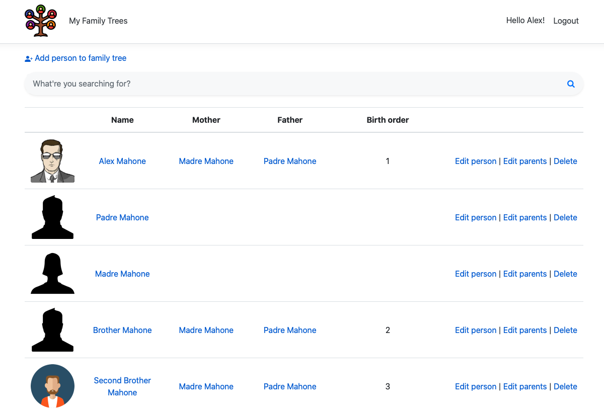

#  &nbsp; Sugupuu

[Andmebaas](#andmebaas) 
 
[Ärireeglid](#ärireeglid)
  
[Pildid](#pildid)
 
[To-do](#to-do) 

 

### Andmebaas

 

- Tabel "User" - Rakendust saavad kasutada vaid registreerunud kasutajad. See on tabel kasutajate hoidmiseks.
- Tabel "FamilyTree" - Tabel, kus hoitakse sugupuusid. Atribuut "IsPublic" määrab, kas sugupuu on nähtav ka teistele kasutajatele.
- Tabel "Person" - Tabel, kus hoitakse isikuid. Iga lisatud isikud kuulub ühte kindlasse sugupuusse. Isikutele on võimalik lisada ka pilte.
- Tabel "Gender" - Teatmik-tüüpi tabel soo määramiseks. Sisaldab vaid kahte eellaetud väärtust - "female" ja "male".
- Tabel "Relationship" - Seos-tüüpi tabel lapse ning vanema vahelise seose tekitamiseks.
- Tabel "RelationshipType" - Teatmik-tüüpi tabel lapse ning vanema vahelise seose tüübi määramiseks. Sisaldab vaid kahte eellaetud väärtust - "mother-child" ja "father-child"
 
 

### Ärireeglid
- Kasutaja peab registreerima ja sisse logima sugupuu loomiseks.
- Uue sugupuu loomisel pannakse sinna automaatselt käesoleva kasutaja isik.
- Lisatava isiku sünnikuupäev ei saa olla tulevikus.
- Isik saab olla ainult mees või naine.
- Isik saab olla korraga ainult ühes sugupuus.
- Laps ei tohi olla vanem kui tema ema või isa.
- Lapsel saab olla ainult üks ema ja üks isa.
- Kui uue isiku loomisel pilti ei lisata, siis lisatakse vaikimisi pilt vastavalt sellele kas ta on naissoost või meessoost.
- Sündimise järjekorra puhul arvestatakse õdesid ja vendasid (ka poolõdesid ja -vendasid).
 
 

### Pildid
#### Sugupuu vaade

 

#### Sugupuu isikud

 

#### Isiku detailvaade

 

#### Isiku muutmine

 

#### Isiku vanemate muutmine

 

#### Isiku kustutamine

 
 

### To-do
- Graafiline sugupuu
- Vaated/filtrid lähisugulaste vaatamiseks (vanaemad, vanaisad, õed, vennad, onud, tädid, nõod)
- Parandada disaini
- Parandada koodi struktuuri (võib-olla repository patternile üle viia?)